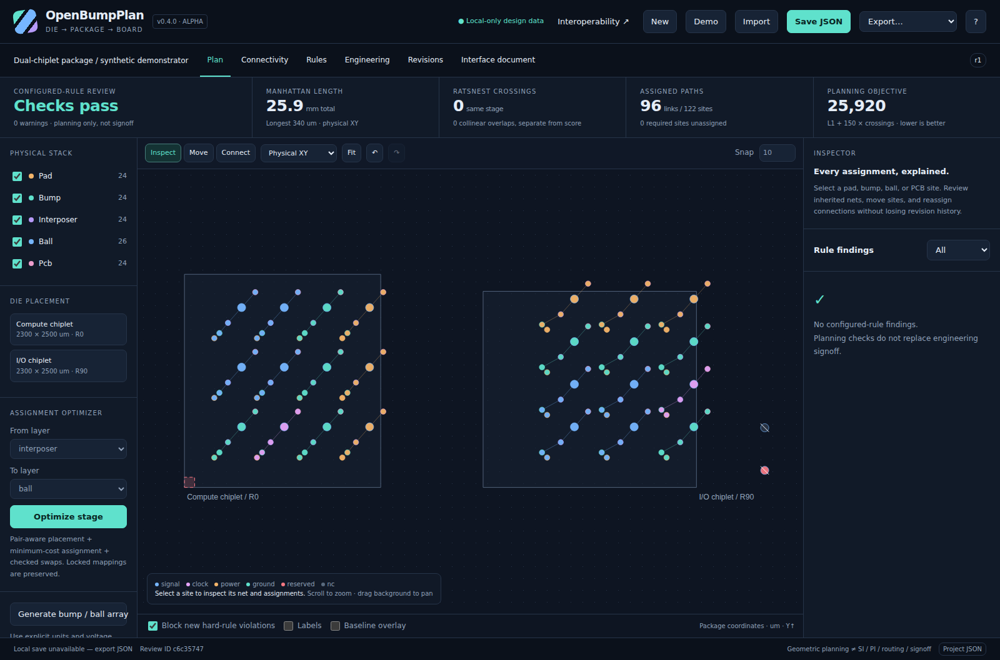

# OpenBumpPlan

**A local-first die/package bump and ball-map planning studio.**

Plan and review **IC pads → microbumps → interposer sites → package balls → PCB sites** in one inspectable, versioned project. Import coordinates, rearrange mappings, check constraints, optimize a stage, compare revisions, and produce an interface-control document without uploading your design to a service.

**Version 0.1.0 · engineering alpha · MIT licensed.** This is working planning software, not a qualified routing, SI/PI, or manufacturing-signoff product. No superiority over commercial EDA systems has been established.



## Start in a minute

The project has **no npm dependencies**. The build, engine, tests, and command-line tools use Node.js built-ins.

```sh
# Node.js 22 or newer:
git clone https://github.com/ajayasai/OpenBumpPlan.git
cd OpenBumpPlan
npm start
```

Open **http://127.0.0.1:4173**. The server is read-only and listens on loopback by default. It neither receives nor saves your project. The browser processes design data locally.

Alternatively, open **`dist/openbumpplan.html`** directly in a modern browser. It includes the application, styles, and optimization worker in one file. File-origin browser policies can restrict workers or storage; the local server is the fallback. Always export project JSON as your durable backup.

No signup, license server, GPU, cloud account, or build step is needed to use the supplied standalone file. `package.json` has `private: true` solely to prevent accidental publication to the npm registry; it does **not** specify GitHub repository visibility.

## Included capabilities

| Area | Implemented in this release |
|---|---|
| Input | Project JSON, pad/bump/interposer/ball/PCB CSV, assignment CSV, explicit um/mm/nm conversion, limited LEF MACRO/PIN/PORT RECT importer with visible limitations |
| Workspace | Physical XY and exploded-stack views, layer toggles, pan/zoom, labels, selection, die placement, 90-degree rotations, X mirroring, generated arrays, drag-to-move with snapping |
| Mapping | Inspect inherited nets/domains, drag/click to connect, explicitly replace occupied assignments, lock sites and links, undo/redo |
| Rules | Net/role/domain compatibility, voltage-domain spacing, differential-pair completeness/adjacency/polarity/length mismatch, clock ground-neighbor checks, power/ground coverage and quotas, reserved/NC positions, rectangular/edge/corner keep-outs, required endpoints and path continuity |
| Geometry | Total and longest physical Manhattan distance, same-stage straight-ratsnest crossings, separately reported collinear overlaps, explicit incomplete-analysis status |
| Optimization | Pair-aware placement, minimum-cost rectangular assignment, checked local swaps, locked-mapping preservation, regression gate, cancellable Web Worker |
| Review | Structural and downstream-propagated revision differences, baseline overlay, machine-readable regression report, local revision history |
| Deliverables | Ports and mappings CSV, project JSON, vector SVG, vector/text PDF, HTML and Markdown ICD, validation JSON, revision-diff JSON |
| Automation | Dependency-free CLI, unit/property/integration tests, optional browser tests, synthetic benchmark harness, Dockerfile, GitHub Actions templates, public-repository publishing script |

The names of the rules are not promises of electrical signoff: “clock shielding” checks nearby connected grounds, and “power distribution” checks geometric coverage and quotas. They do not calculate return-current paths, impedance, voltage drop, current capacity, or electromigration.

## Try the included example

The startup project is synthetic: two chiplets, **122 sites**, **96 links**, all five stages, ground/power/clock signals, differential pairs, one rotated die, reserved/NC sites, and deliberate assignment crossings.

1. Select a site in **Plan**. Its inspector shows declared and inherited information. Hide layers to disambiguate overlapping sites; use **Move** for geometry or **Connect** for mappings.
2. With **interposer → ball** selected, click **Optimize stage**. On this example, the score changes **27,540 → 25,920** and crossings **2 → 0**, with no hard-rule errors.
3. Open **Revisions** to see the changed mappings and downstream signals. Open **Interface document** to review the generated ICD. Export JSON and PDF.

The optimizer minimizes a planning proxy:

```text
score = sum of physical Manhattan lengths (um)
      + crossingWeight * same-stage straight-ratsnest crossings
```

Crossings are not routed-layer shorts, and L1 length is not electrical length. The linear assignment subproblem is exact; the full coupled problem with pairs, grounds, domains, crossings, and locks is **heuristic**, not globally optimal.

## Command-line use

```sh
npm test
npm run build
npm run benchmark

node scripts/cli.mjs check examples/chiplet-demo.json
node scripts/cli.mjs check examples/chiplet-optimized.json --fail-on warning
node scripts/cli.mjs optimize examples/chiplet-demo.json optimized.json --from interposer --to ball
node scripts/cli.mjs diff examples/chiplet-demo.json optimized.json --gate --json
node scripts/cli.mjs export optimized.json interface.pdf
node scripts/cli.mjs export optimized.json assignments.csv --format connections
```

Check exit codes: **0** policy passed, **1** findings violate the chosen policy, **2** malformed input or command failure. The default permits warnings; `--fail-on warning` rejects them. Full JSON is the authoritative lossless project format.

## Validation and performance

The release includes **151 passing Node tests** and **12 passing Chromium integration scenarios**. Browser scenarios exercise the actual standalone build, including worker optimization, pointer dragging, reassignment, strict-edit rollback, import preview, downloads, and revision review. The browser harness uses `set_content` because the original delivery environment blocked file/localhost navigation; native navigation and real-origin storage persistence were not verified by this harness. See [validation details](docs/VALIDATION.md) and the machine-readable results.

A favorable sparse synthetic case with **8,000 sites / 4,000 connections** took about **33.7 ms median** for engine analysis in the original delivery environment. That is **not** a large-scale interactive UI benchmark, a worst-case guarantee, or a commercial comparison. Dense geometry can exhaust the explicit analysis budget, in which case the application reports incompleteness rather than a clean result.

## Public source and CI

The public repository is **[ajayasai/OpenBumpPlan](https://github.com/ajayasai/OpenBumpPlan)**. The complete source, standalone build, synthetic examples, generated interface-control documents, tests, and MIT license are committed on `main`.

[GitHub Actions](https://github.com/ajayasai/OpenBumpPlan/actions) runs the engine tests, rebuilds the offline app, checks the examples, and uploads the standalone app as a workflow artifact. The initial publication also reproduced all 12 Chromium workflow scenarios; see [the publication record](docs/PUBLICATION.md) for the immutable source commit and test run.

To contribute, clone the repository, create a branch, make your changes, and run `npm test` and `npm run build` before opening a pull request. The historical `npm run publish:github` script creates a **new** repository and intentionally refuses this already-existing target; it is not an update command.

Optional GitHub Pages deployment remains manual. See [publishing and deployment instructions](docs/PUBLISHING.md). No live Pages deployment is implied by publishing the source. Only synthetic examples are included; never commit proprietary imports, reports, or customized embedded demo data.

## Scope and extension points

Read [the exact data/rule semantics](docs/FORMAT.md), [architecture](docs/ARCHITECTURE.md), [competitive scope and roadmap](docs/COMPETITIVE_SCOPE.md), and [security boundaries](SECURITY.md).

Important exclusions: native Cadence/Synopsys databases, full LEF/DEF/GDS/ODB++/IPC-2581 support, routing/escape/via synthesis, same-stage lateral connectivity, electrical fanout, Z-aware TSV/face alignment, SI/PI/thermal/mechanical analysis, current-aware power delivery, process-qualified DRC, tamper-proof approvals, real-time collaboration, and demonstrated industrial-scale capacity.

Contributions should include a reproducible synthetic fixture and tests, not unsupported feature-parity or signoff claims. See [CONTRIBUTING.md](CONTRIBUTING.md).
