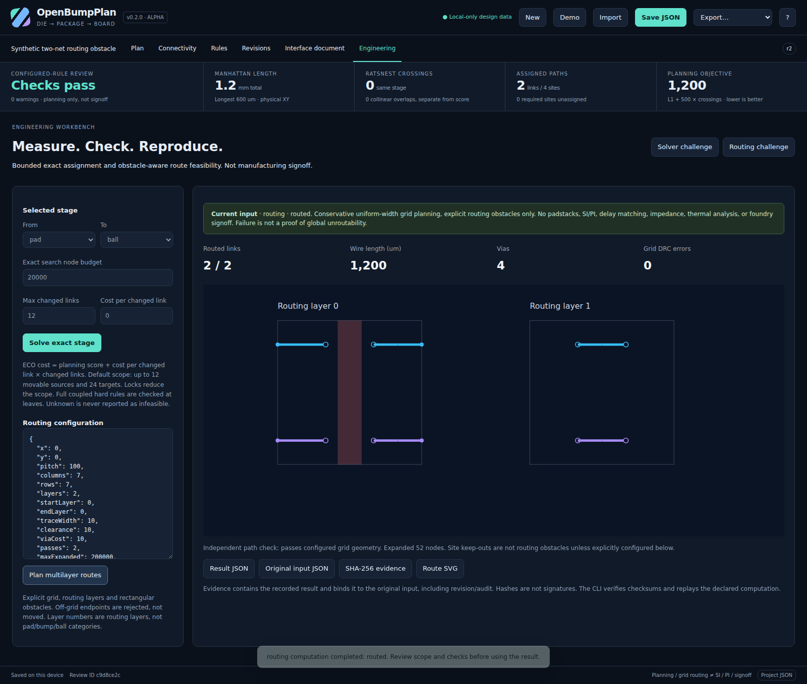

# OpenBumpPlan

**Local-first die/package planning with inspectable optimization and reproducible engineering evidence.**

Plan **IC pads → microbumps → interposer sites → package balls → PCB sites**. Import coordinates, edit assignments, enforce planning constraints, compare revisions, and generate interface-control documents without uploading design data.

**v0.2.0 · MIT · engineering alpha.** No npm dependencies. Not a manufacturing-signoff product, and not demonstrated superior to every commercial EDA system.



## Run

```sh
# Node.js 22 or newer. No npm install is needed.
git clone https://github.com/ajayasai/OpenBumpPlan.git
cd OpenBumpPlan
npm start
```

Open **http://127.0.0.1:4173**. The read-only server binds to loopback; projects are processed and saved in the browser, not sent to the server. Export JSON for durable backups. The supplied `dist/openbumpplan.html` is also a self-contained offline app; browser file-origin policies vary. No signup, telemetry, CDN, GPU, cloud account or license server is required. `private: true` in `package.json` only prevents accidental npm registry publication; the GitHub source repository is public.

## New: Engineering workbench

Open **Engineering → Solver challenge → Solve exact stage**. Review the bounds and constraints, then explicitly apply the checked candidate. Or open **Routing challenge → Plan multilayer routes** to inspect obstacle avoidance and vias on separate routing layers.

| Capability | Implemented behavior |
|---|---|
| Small-stage exact assignment | Deterministic branch-and-bound, complete hard-rule evaluation, lower/upper bounds, explicit optimal/feasible/infeasible/unknown statuses and numeric tolerance. Defaults: 12 movable sources, 24 targets, 20,000 nodes. |
| Engineering-change control | Hard cap on changed assignments and configurable cost per change; existing locks preserved. |
| Infeasibility explanations | Hall-deficient source/target sets with IDs and capacity deficits; coupled-rule rejection diagnostics. A cutoff is never labeled infeasible. |
| Multilayer grid routing | Fixed endpoints, explicit rectangular routing obstacles, trace/clearance inflation, adjacent-layer vias, bounded routing-order retries, no silent coordinate snapping. |
| Independent path validation | Endpoint, step, obstacle, cross-route clearance, coverage, planar length and pair-skew checks. Budget exhaustion cannot pass. |
| Reproducible evidence | SHA-256 input/result/envelope binding, engine versions, deterministic replay, stale-input and forged-result rejection. Hashes are not signatures or approvals. |
| Safe interactive use | Cancellable workers, complete-input staleness checks, review before apply, undo/redo, original-input export and routed SVG. |

The exact oracle is scoped to one small stage, **not industrial-scale simultaneous assignment/routing**. The router is a conservative uniform-width grid model, **not padstack-aware detailed routing**. See [precise guarantees, limits and commands](docs/ENGINEERING.md).

## Measured regression improvements

On the shipped six-source, six-target coupled-pair challenge:

| Method | Planning score | Hard-rule errors |
|---|---:|---:|
| Original checked heuristic | 4,450 | 0 |
| New exact oracle | **2,850** | **0** |
| Independent enumeration of all 720 permutations | **2,850** | **0** |

The 35.96% score reduction is real **on this selected synthetic challenge**, found in a seeded search. It is not an average-case claim or a commercial comparison. A four-link change budget obtains the improved result; budgets of zero or two preserve the old heuristic mapping.

The routing challenge has two links blocked by an explicit wall on routing layer 0. Two routing layers produce two checked paths, four vias and 1,200 um planar wire. One layer produces no routes in this model. Reproduce both with `npm run benchmark:engineering`; inspect [raw measurements and disclosure](docs/engineering-benchmark.json).

## Existing planning studio

The original studio remains available: physical/exploded views, layer visibility, die rotation/mirroring, drag/snap movement, connection reassignment, locks, undo/redo, array generation and CSV/JSON/limited LEF import. The rule engine checks net/role/domain compatibility, domain spacing, pair adjacency/polarity/skew, nearby grounds for clocks, power/ground coverage/quotas, reserved/NC sites, endpoint keep-outs and path completeness. Revision comparison includes inherited-signal and transform effects.

Exports include project JSON, ports/mapping CSV, SVG, PDF, HTML/Markdown interface-control documents, validation and revision-difference reports. LEF supports the documented MACRO/PIN/PORT RECT subset, not full LEF/DEF. Clock shielding and power coverage are geometric proxies, not electromagnetic or power-integrity analysis.

The startup two-chiplet example has 122 sites and 96 links. **Plan → interposer to ball → Optimize stage** changes its planning score from 27,540 to 25,920 and crossings from two to zero, with no hard-rule errors. This original optimizer remains a heuristic with a linear-assignment subproblem; use Engineering for the bounded exact oracle.

## CLI and reproduction

```sh
npm test
npm run build
npm run benchmark:engineering
node scripts/cli.mjs check examples/chiplet-optimized.json --fail-on warning
node scripts/cli.mjs exact examples/exact-challenge.json exact.json --from pad --to ball
node scripts/cli.mjs verify examples/exact-challenge.json exact.json
node scripts/cli.mjs route examples/routing-challenge.json routing.json --config examples/routing-config.json --svg routes.svg
node scripts/cli.mjs check-routes examples/routing-challenge.json routing.json
node scripts/cli.mjs verify examples/routing-challenge.json routing.json
```

`exact` also accepts `--nodes`, `--max-changes` and `--change-penalty`. Exact and route commands output **evidence documents**, not silent project overwrites. The candidate project is in the exact result. `verify` checks that the recorded result is honestly reproduced: it may succeed for an infeasible/partial result, so inspect `planningPass` and `status`. Exit 2 indicates malformed input/usage. See [full semantics](docs/ENGINEERING.md).

## Testing and public source

The v0.2.0 suite contains **240 Node tests** and **17 browser workflow scenarios**, plus **five native-origin checks**. The latter test real reload persistence, browser-to-Node SHA-256/replay and standalone file loading. They are separate from the embedded-page harness; an environment that blocks native loading does not count as native test coverage. CI executes the checks and publishes their actual results. See [release validation](docs/VALIDATION-v0.2.md) and [GitHub Actions](https://github.com/ajayasai/OpenBumpPlan/actions).

The [initial publication record](docs/PUBLICATION.md) and [v0.1 validation](docs/VALIDATION.md) remain historical records. Version 0.2 expands their scope; it does not retroactively alter the tests performed on v0.1.

Only synthetic designs are committed. Never publish proprietary imports, browser snapshots or reports. The historical `npm run publish:github` creates a new repository and refuses an existing target; it is not an update command. Optional Pages deployment is separate from source publication; see [deployment instructions](docs/PUBLISHING.md).

## Boundaries and contribution

No native Cadence/Synopsys databases, production padstack/escape routing, foundry-qualified DRC, SI/PI/thermal/mechanical solvers, process certification, authenticated approvals, simultaneous collaborative editing or demonstrated industrial-scale capacity are claimed. The [engineering guide](docs/ENGINEERING.md) contrasts this release with primary commercial documentation rather than inventing parity.

Read [data/rule semantics](docs/FORMAT.md), [architecture](docs/ARCHITECTURE.md), [security boundaries](SECURITY.md) and [contribution guidelines](CONTRIBUTING.md). Contributions need reproducible fixtures and tests, not unsupported superiority or signoff statements.
